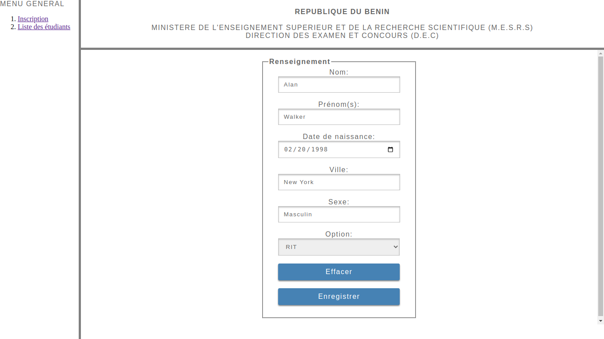
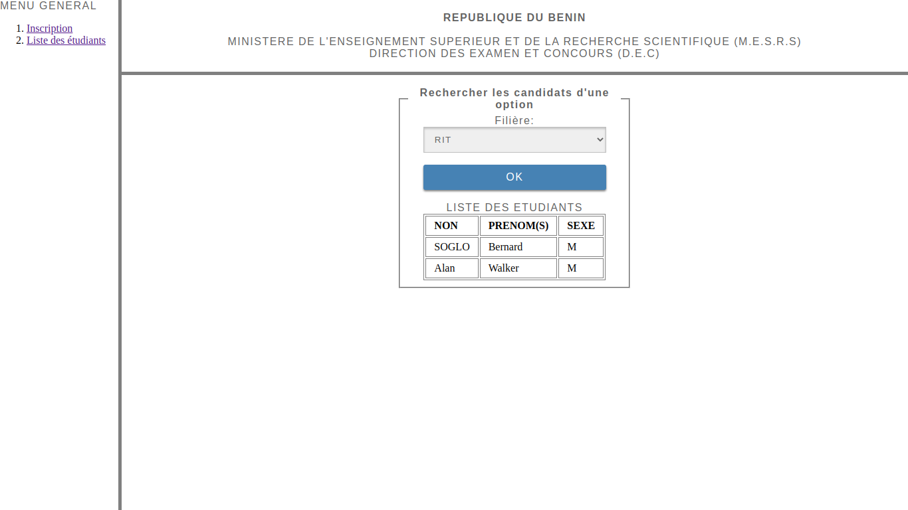

# Students Sign Up


This small project is an academy project. The main goal of this app is to be able to save students data as well as load theirs data from a database. This app uses native Web Development Languages on front-end and PHP on back-end to manage client requests. PhpMyAdmin and MySQL is used to control app database. The communication between front-end and back-end uses AJAX method and JSON to transfer data from the front-end to back-end. This app doesn't reload the active page before call another page. Each page is saw as a part of application.

## Final result
This is the final result of the project:<br/><br/>



## Project installation

### <u>Install XAMPP or WAMP</u>:
- For XAMPP downloading, you can find it at this link: <a href = "https://www.apachefriends.org/fr/download.html">https://www.apachefriends.org/fr/download.html</a>
- For WAMP downloading, you can find it at this link: <a href = "https://www.wampserver.com/en">https://www.wampserver.com/en/</a>

### <u>Project cloning</u>:
```sh
git clone git@github.com:obrymec/Students-Sign-Up.git students-sign-up/
```

### <u>Tasks before run the project</u>:
After you clone the project, you should do the following tasks before run it:
- Move the project folder to your Wampp or Xampp server folder;
- Turn on your Wampp or Xampp server;
- Go to phpMyAdmin in your favorite browser or via the link: http://localhost/phpmyadmin/
- Create a database named exactly like this: <i><strong>students_signup</strong></i>;
- Select the newly created database;
- Click on the <i><strong>Import</strong></i> tab at the top;
- Click on the <i><strong>Choose a file</strong></i> button in the <i><strong>File to import</strong></i> section;
- Load the file <i><strong>tables.sql</strong></i> located at the root of the project;
- Then click on the <i><strong>Import</strong></i> button located at the very bottom of the page.<br/>
After this operation, you will see that tables have been automatically created in your database named <i><strong>students_signup</strong></i>.
- Select your database again and import the file <i><strong>remplir.sql</i></strong> in the same way as <i><strong>tables.sql</i></strong>.<br/>
After this operation you will see that the tables <strong>OPTION</strong> and <strong>ETUDIANT</strong> have been automatically filled with data.<br/>
Now you are ready to run the project.

### <u>Run project</u>:
To navigate between project views, you can uses the following below links:
- http://localhost/students-sign-up/indexDEC.html

<u><strong>Pay Attention</strong></u>: Make sure that the project folder name is: <i><strong>students-sign-up</i></strong>

Enjoy :)
